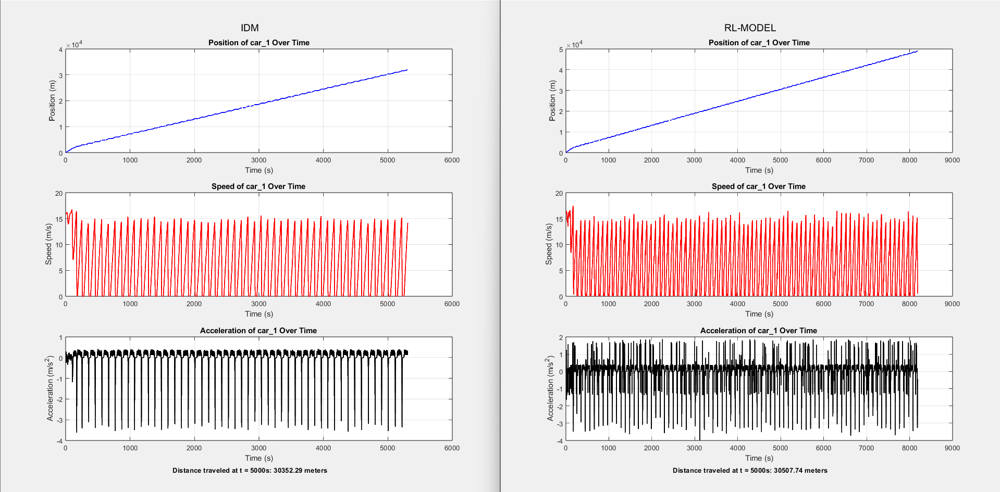

# traffic-simulation.de
Source code for the interactive Javascript simulation at  [traffic-simulation.de](https://traffic-simulation.de)

The simulations should be self-explaining and is also explained in the instruction boxes in most scenarios.

Besides simulating online, you can also use this simulator to generate vehicle trajectory files and virtual detector data files by using the blue download button (details further below).

Information on the used models and numerical integration schemes can be found in the links on the simulator page. In the following, I give some overview  about the implementation.

## explenation about the project

I have recently worked on a project focused on mitigation of phantom traffic congestions using Adaptive Cruise Control on AV's, A ReInforcement Learning based model has been used in this project lots of features have been added in the files mentioned below most of the modifications were inlign with the research goals and have been costumized to meet some certain criteria, at last huge credit to the Movsim team for their awesome simulation platform without them this would have not happened. A matlab file has also been made to sketch the recorded data for further data analysis which has also been uploaded to this repository 

    

## ring.html

Due all respect i have for your awesome test bed i have made some modifications so that it alligns with my research on stop and go traffic waves and paths to its mitigaion The ring.html has been enhanced some of the extra features have been deleted just to make space for the purpose specific usage (RL-modeling for vehicle IDs and other function buttons in the bottom segment of the page) each of details and functions will be explained further with more detail below. changes made:

an ID section has been added in the top right corner that indicated the ids of the vehicles
now the record data button records the movement of one veh by its id instead of all of them, you could also write in the id of the vehicle but if you leave it empty it would do veh 200 by default this way you can make better analysis on driving behaviors specially if you are implementing a costumized model like me.
there are bunch of other buttons which self explain. like the local RL model and its size and gap between veh 200 and 222 (the one in front of it)
controller type when you are using a hybrid model
laps for counting during recording data so you have track of how many laps have been taken by veh 200 (leading veh)

    

## ring.js file

In this section i have made a costumized self trained unsupervized RL model for veh id 200 that updates itself on each run and is stored locally in the browser. also a lot of research alligned costumized enhancements have been done that have been explained in detail in the upper directories ring.html running the code is highly suggest to visually see the changes made. most of the buttons functionality have been declared here.
note that these are suggestions and by no mean am i requesting you to change the original code. the changes as mentioned earlier were research alligned for creating a controller that mitigates stop and go waves

### models.js

a collection of pseudo-classes for the longitudinal models (presently, the IDM and an extension from it, the ACC model), and lane-changing decision models (presently, MOBIL), see the _references_ section for details. In addition to the pure models, following features are implemented.

* White acceleration noise of intensity `QnoiseAccel` that is also uncorrelated between vehicles. This leads to a random walk in speed with average speed difference sqrt(QnoiseAccel*dt). Since the longitudinal model is also used for lane changes (MOBIL) and decisions at intersections, a deterministic version of the acceleration is also provided.

* Inter-driver variations `driverfactor` with a uniform distribution around 1. Both the desired speed and the desired acceleration are multiplied by `driverfactor`. Since model parameters are often changed due to user interaction, speed limits, bottlenecks etc and the driverfactor should survive that, it is taken from the vehicle's driverfactor after each model change

* `speedlimit`s. These override all user-set desired speeds and also the driverfactor but not the acceleration noise

### How to implement new models

This is now described at the beginning of models.js. Basically, the steps are

* Define the constructor and implement all methods that are also present in the old models  (e.g., `ACC`) in `models.js`

* set the model templates to the new model; if needed, also introduce new gui-sliders in `control_gui.js` and the .html files

* redefine the slider interactions and model update in `control_gui.js` and `road.js`

To help in implementing, I defined the global flag `testNewModel` in `control_gui.js`. If set to true, a new skeleton "CACC" model will be used which is essentially the IDM. To check if this really works, I set the desired speed for the truck template to 3 m/s (you will see slow trucks if this works as intended). So you need just change all locations where `testNewModel` is used and you are done for all simulations.

## References 

[1] M. Treiber, A. Hennecke, and D. Helbing. _Congested traffic states in empirical observations and microscopic simulations._ Physical review E 62 1805-1824 (2000). [Link](http://journals.aps.org/pre/pdf/10.1103/PhysRevE.62.1805), [Preprint](http://arxiv.org/abs/cond-mat/0002177)

[2] M. Treiber and A. Kesting. [_Traffic Flow Dynamics, Data, Models and Simulation_](http://www.traffic-flow-dynamics.org). Springer 2013. [Link](http://www.springer.com/physics/complexity/book/978-3-642-32459-8)

[3] A. Kesting, M. Treiber, and D. Helbing. _General lane-changing model MOBIL for car-following models_.   Transportation Research Record, 86-94 (2007). [Paper](http://www.akesting.de/download/MOBIL_TRR_2007.pdf)
    
[4] A. Kesting, M. Treiber, and D. Helbing. _Enhanced intelligent driver model to access the impact of driving strategies on traffic capacity_. Philosophical Transactions of the Royal Society A, 4585-4605 (2010). [Preprint](http://arxiv.org/abs/0912.3613)
    
[5] M. Treiber, and A. Kesting. An open-source microscopic traffic
simulator.     IEEE Intelligent Transportation Systems Magazine, 6-13
(2010). [Preprint](http://arxiv.org/abs/1012.4913)

[6] M. Treiber and V. Kanagaraj.
Comparing Numerical Integration Schemes for Time-Continuous Car-Following Models
Physica A: Statistical Mechanics and its Applications 419C, 183-195
DOI 10.1016/j.physa.2014.09.061 (2015).
[Preprint](http://arxiv.org/abs/1403.4881)
